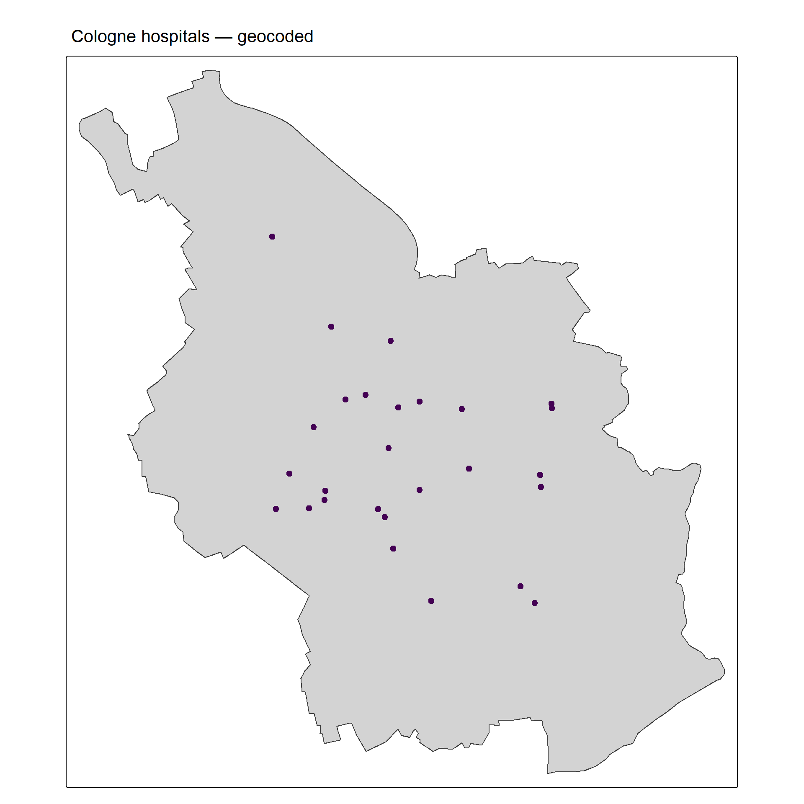
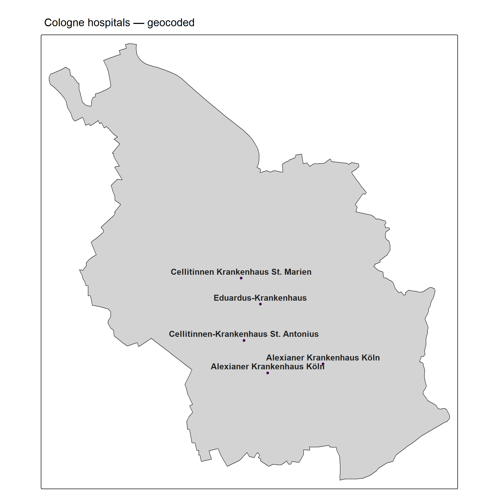
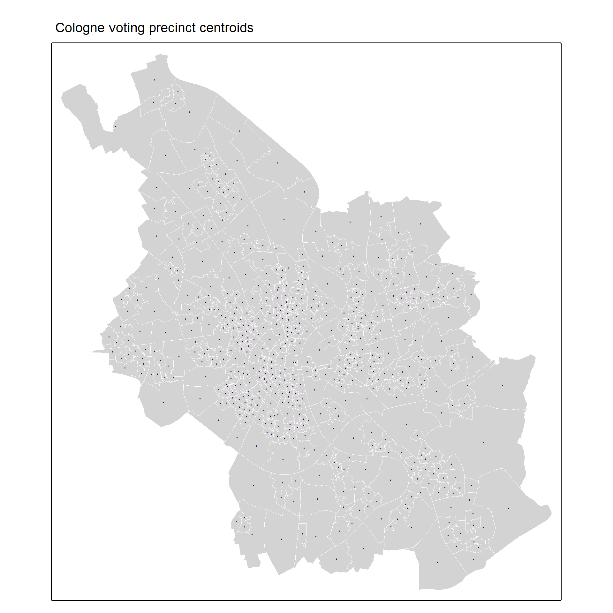
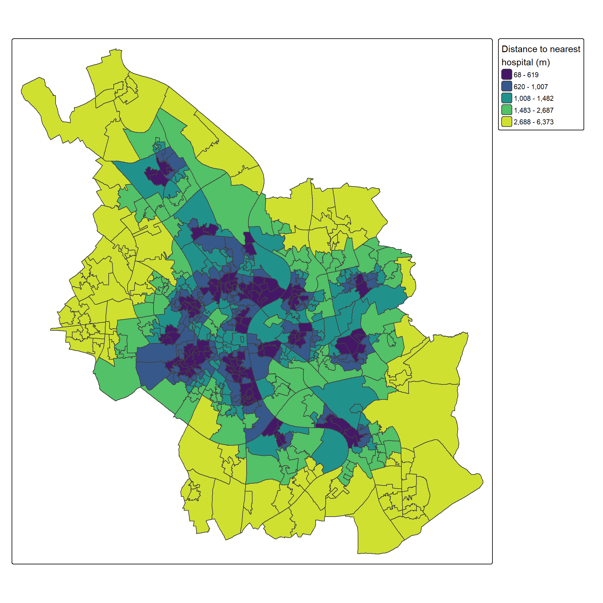
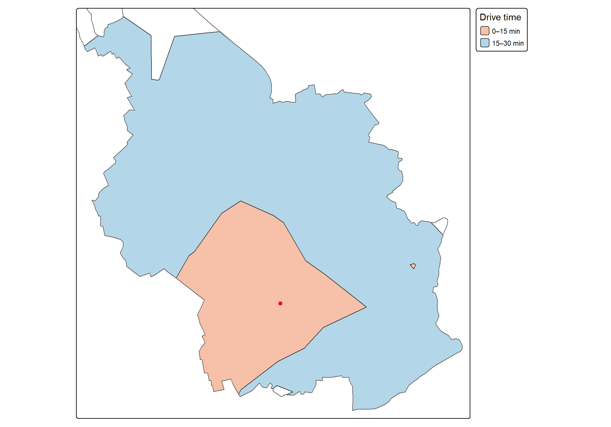
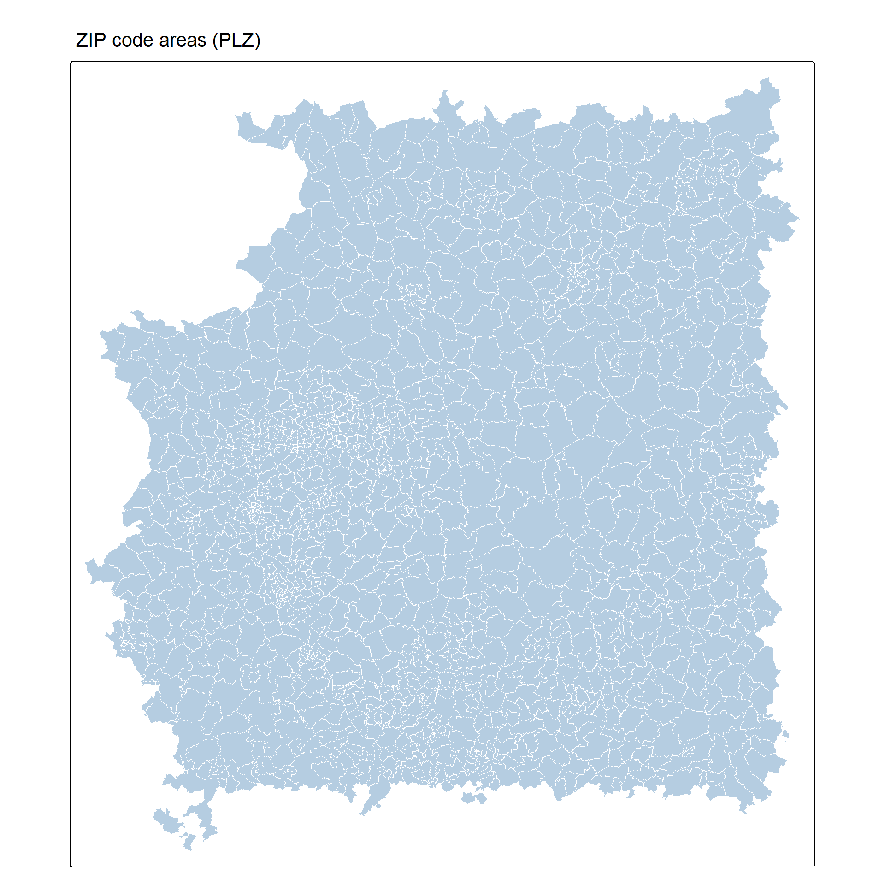
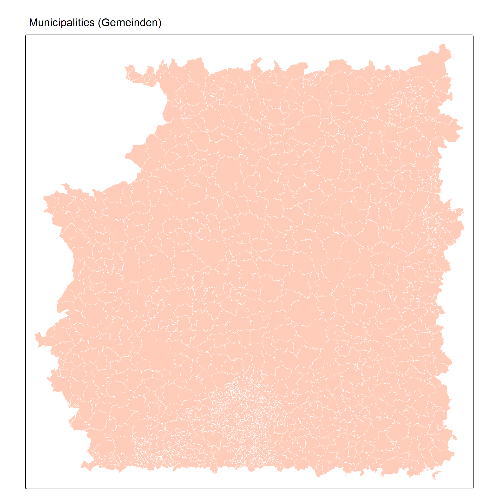
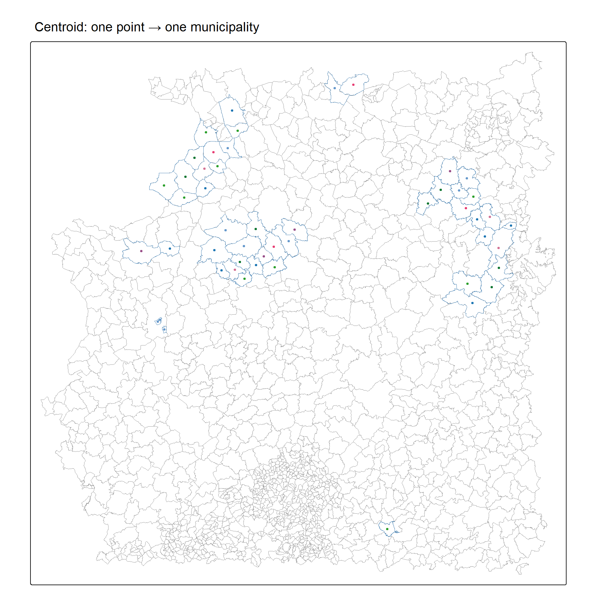
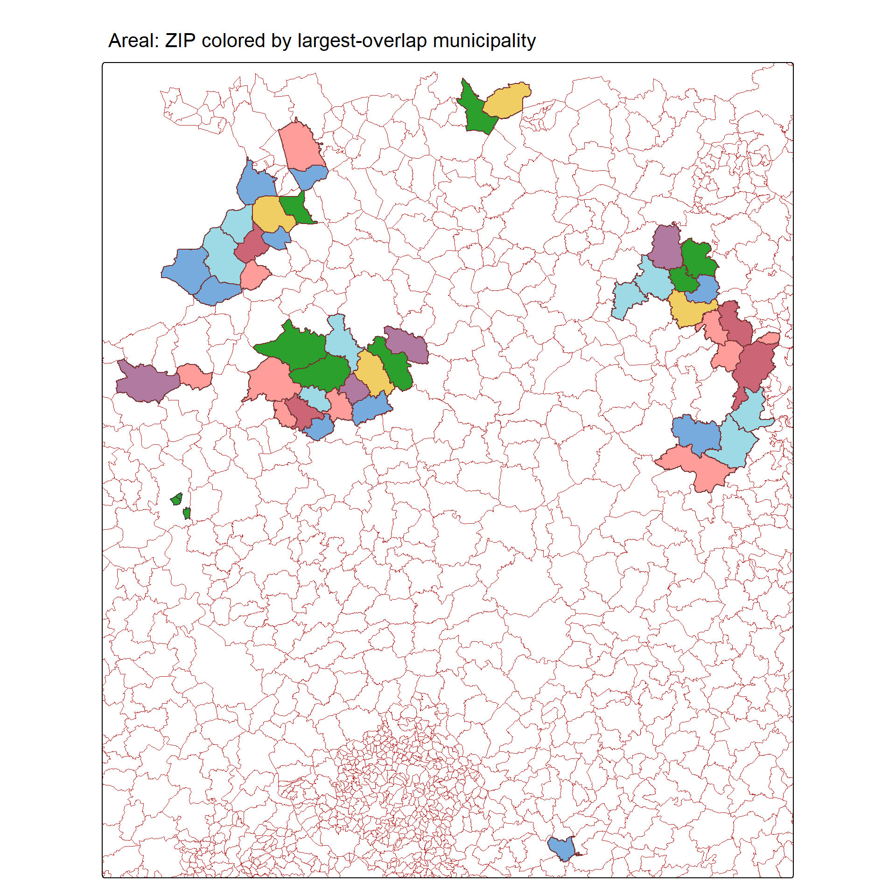
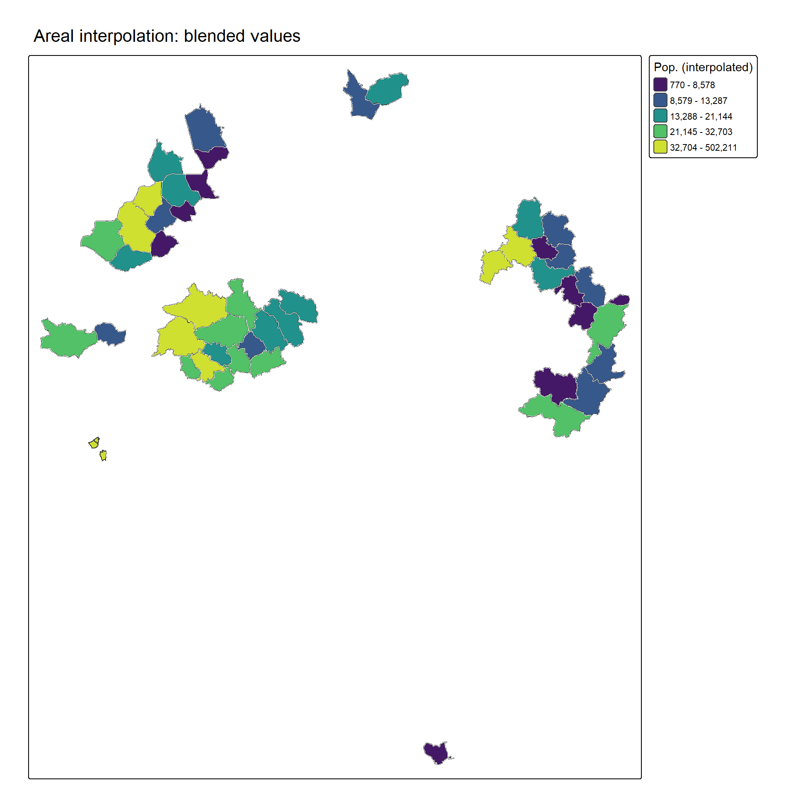

## Now


::: {.cell}
::: {.cell-output-display}
`````{=html}
<table class="table table" style="margin-left: auto; margin-right: auto; font-size: 20px; margin-left: auto; margin-right: auto;">
 <thead>
  <tr>
   <th style="text-align:left;"> Day </th>
   <th style="text-align:left;"> Time </th>
   <th style="text-align:left;"> Title </th>
  </tr>
 </thead>
<tbody>
  <tr>
   <td style="text-align:left;color: gray !important;"> June 11 </td>
   <td style="text-align:left;color: gray !important;"> 10:00-11:30 </td>
   <td style="text-align:left;font-weight: bold;"> Introduction </td>
  </tr>
  <tr>
   <td style="text-align:left;color: gray !important;color: gray !important;"> June 11 </td>
   <td style="text-align:left;color: gray !important;color: gray !important;"> 11:30-11:45 </td>
   <td style="text-align:left;font-weight: bold;color: gray !important;"> Coffee Break </td>
  </tr>
  <tr>
   <td style="text-align:left;color: gray !important;"> June 11 </td>
   <td style="text-align:left;color: gray !important;"> 11:45-13:00 </td>
   <td style="text-align:left;font-weight: bold;"> Data Formats </td>
  </tr>
  <tr>
   <td style="text-align:left;color: gray !important;color: gray !important;"> June 11 </td>
   <td style="text-align:left;color: gray !important;color: gray !important;"> 13:00-14:00 </td>
   <td style="text-align:left;font-weight: bold;color: gray !important;"> Lunch Break </td>
  </tr>
  <tr>
   <td style="text-align:left;color: gray !important;"> June 11 </td>
   <td style="text-align:left;color: gray !important;"> 14:00-15:30 </td>
   <td style="text-align:left;font-weight: bold;"> Mapping </td>
  </tr>
  <tr>
   <td style="text-align:left;color: gray !important;color: gray !important;"> June 11 </td>
   <td style="text-align:left;color: gray !important;color: gray !important;"> 15:30-15:45 </td>
   <td style="text-align:left;font-weight: bold;color: gray !important;"> Coffee Break </td>
  </tr>
  <tr>
   <td style="text-align:left;color: gray !important;border-bottom: 1px solid"> June 11 </td>
   <td style="text-align:left;color: gray !important;border-bottom: 1px solid"> 15:45-17:00 </td>
   <td style="text-align:left;font-weight: bold;border-bottom: 1px solid"> Spatial Wrangling </td>
  </tr>
  <tr>
   <td style="text-align:left;color: gray !important;"> June 12 </td>
   <td style="text-align:left;color: gray !important;"> 10:00-11:30 </td>
   <td style="text-align:left;font-weight: bold;"> Spatial Wrangling </td>
  </tr>
  <tr>
   <td style="text-align:left;color: gray !important;color: gray !important;"> June 12 </td>
   <td style="text-align:left;color: gray !important;color: gray !important;"> 11:30-11:45 </td>
   <td style="text-align:left;font-weight: bold;color: gray !important;"> Coffee Break </td>
  </tr>
  <tr>
   <td style="text-align:left;color: gray !important;background-color: yellow !important;"> June 12 </td>
   <td style="text-align:left;color: gray !important;background-color: yellow !important;"> 11:45-13:00 </td>
   <td style="text-align:left;font-weight: bold;background-color: yellow !important;"> Spatial Data Linking </td>
  </tr>
  <tr>
   <td style="text-align:left;color: gray !important;color: gray !important;"> June 12 </td>
   <td style="text-align:left;color: gray !important;color: gray !important;"> 13:00-14:00 </td>
   <td style="text-align:left;font-weight: bold;color: gray !important;"> Lunch Break </td>
  </tr>
  <tr>
   <td style="text-align:left;color: gray !important;"> June 12 </td>
   <td style="text-align:left;color: gray !important;"> 14:00-15:30 </td>
   <td style="text-align:left;font-weight: bold;"> Spatial Analysis </td>
  </tr>
  <tr>
   <td style="text-align:left;color: gray !important;color: gray !important;"> June 12 </td>
   <td style="text-align:left;color: gray !important;color: gray !important;"> 15:30-15:45 </td>
   <td style="text-align:left;font-weight: bold;color: gray !important;"> Coffee Break </td>
  </tr>
  <tr>
   <td style="text-align:left;color: gray !important;"> June 12 </td>
   <td style="text-align:left;color: gray !important;"> 15:45-17:00 </td>
   <td style="text-align:left;font-weight: bold;"> Spatial Econometrics &amp; Outlook </td>
  </tr>
</tbody>
</table>

`````
:::
:::


## What is Spatial Data Linking?

Sometimes datasets don't have a geocodes, do not include the indicators you need or share congruent borders that make them easy to join

**We add to our toolbox:**

::: {.incremental}
- 🗺️ **Geocoding** — addresses → coordinates
- 📏 **Distance & Proximity** — how far? nearest what?
- 🚗 **Travel Time** — real-world accessibility
- 🔀 **Areal Interpolation** — transferring data across incongruent units
:::

## Geocoding {.center style="text-align: center;"}

## Geocoding

Geocoding is the conversion of indirect spatial references (e.g., addresses) into direct spatial references (e.g., coordinates)

However, conducting this procedure is tricky (not only in `R`). Many services are either

- Expensive (at least they cost money or have other restrictions)
- Probably not data protection-friendly (Hey Google)
- Or both


## Georeferenced survey data

One example: Survey data enriched with geo-coordinates (or other direct spatial references).

{.r-stretch fig-align="center"}

**With georeferenced survey data, we can analyze interactions between individual behaviors and attitudes and the environment.**

## Issue Data Protection

:::: columns
::: {.column width="50%"}
Explicit spatial references increase the risk of re-identifying anonymized survey respondents: In Germany, storing personal information such as addresses in the same place as actual survey attributes is usually not allowed.

- Projects keep them in separate locations
- Can only be matched with a correspondence table
- Necessary to conduct data linking
- Access often only via Safe Rooms/Secure Data Centers
:::

::: {.column width="50%"}
{fig-align="center" width="70%"}


:::
::::


## Our example today: Hospitals (Destatis)

The German Federal Statistical Office ([Destatis](https://www.destatis.de)) publishes an annual **hospital directory** with names and full addresses of all ~1,900 hospitals in Germany that are freely downloadable.

We work with **Cologne hospitals**:


::: {.cell output-location='fragment'}

```{.r .cell-code}
hospitals_cologne <- readxl::read_excel("./data/krankenhausverzeichnis.xlsx", sheet = 5, skip = 2, col_names=TRUE) |> 
  dplyr::select(1:2,4:9) |>
  setNames(c("state", "district", "name", "name2", "street", "housenumber", "zip", "place")) |> 
  dplyr::mutate(address = paste(street, housenumber, zip, place, "Germany"))   |> 
  dplyr::filter(grepl("K.ln", place, ignore.case = TRUE)) 

hospitals_cologne |>
  dplyr::select(name, street, housenumber, zip, place)
```

::: {.cell-output .cell-output-stdout}

```
# A tibble: 29 × 5
   name                                      street            housenumber zip   place
   <chr>                                     <chr>             <chr>       <chr> <chr>
 1 Alexianer Krankenhaus Köln                Brückenstr.       45          50996 Köln 
 2 Alexianer Krankenhaus Köln                Kölner Str.       64          51149 Köln 
 3 Cellitinnen Krankenhaus St. Marien        Kunibertskloster  11-13       50668 Köln 
 4 Cellitinnen-Krankenhaus St. Antonius      Schillerstr.      23          50968 Köln 
 5 Eduardus-Krankenhaus                      Custodisstr.      3-17        50679 Köln 
 6 Evangelisches Klinikum Köln Weyertal      Weyertal          76          50931 Köln 
 7 Evangelisches Krankenhaus Kalk gGmbH      Buchforststraße   2           51103 Köln 
 8 Heilig Geist-Krankenhaus GmbH             Graseggerstr.     105         50737 Köln 
 9 Klinik Alteburger Straße gGmbH            Alteburger Straße 8-12        50678 Köln 
10 Kliniken der Stadt Köln Standort Holweide Neufelder Str.    32          51067 Köln 
# ℹ 19 more rows
```


:::
:::


## Geocoding with `tidygeocoder`

[`tidygeocoder`](https://jessecambon.github.io/tidygeocoder/) provides a tidy interface to many geocoding services. No API key needed when using **OpenStreetMap/Nominatim** (`method = "osm"`).


::: {.cell}

```{.r .cell-code}
hospitals_geocoded <- hospitals_cologne |>
  tidygeocoder::geocode(
    address = address,   # "Brückenstr. 45 50996 Köln Germany"
    method  = "osm"
  )

hospitals_geocoded |>
  dplyr::select(name, street, housenumber, zip, place, long, lat)
```

::: {.cell-output .cell-output-stdout}

```
# A tibble: 29 × 7
   name                                      street            housenumber zip   place  long   lat
   <chr>                                     <chr>             <chr>       <chr> <chr> <dbl> <dbl>
 1 Alexianer Krankenhaus Köln                Brückenstr.       45          50996 Köln   6.99  50.9
 2 Alexianer Krankenhaus Köln                Kölner Str.       64          51149 Köln   7.04  50.9
 3 Cellitinnen Krankenhaus St. Marien        Kunibertskloster  11-13       50668 Köln   6.96  50.9
 4 Cellitinnen-Krankenhaus St. Antonius      Schillerstr.      23          50968 Köln   6.97  50.9
 5 Eduardus-Krankenhaus                      Custodisstr.      3-17        50679 Köln   6.98  50.9
 6 Evangelisches Klinikum Köln Weyertal      Weyertal          76          50931 Köln   6.93  50.9
 7 Evangelisches Krankenhaus Kalk gGmbH      Buchforststraße   2           51103 Köln   7.01  50.9
 8 Heilig Geist-Krankenhaus GmbH             Graseggerstr.     105         50737 Köln   6.93  51.0
 9 Klinik Alteburger Straße gGmbH            Alteburger Straße 8-12        50678 Köln   6.96  50.9
10 Kliniken der Stadt Köln Standort Holweide Neufelder Str.    32          51067 Köln   7.06  51.0
# ℹ 19 more rows
```


:::
:::


## Geocoding with `tidygeocoder`


::: {.cell output-location='fragment'}

```{.r .cell-code}
# Convert to sf point layer
hospitals_sf <- hospitals_geocoded |>
  dplyr::filter(!is.na(long)) |>
  sf::st_as_sf(coords = c("long", "lat"), crs = 4326) |>
  sf::st_transform(3035)

hospitals_sf |> 
  head(10)
```

::: {.cell-output .cell-output-stdout}

```
Simple feature collection with 10 features and 9 fields
Geometry type: POINT
Dimension:     XY
Bounding box:  xmin: 4104920 ymin: 3091050 xmax: 4114259 ymax: 3102348
Projected CRS: ETRS89-extended / LAEA Europe
# A tibble: 10 × 10
   state district name                            name2 street housenumber zip   place address          geometry
   <chr> <chr>    <chr>                           <chr> <chr>  <chr>       <chr> <chr> <chr>         <POINT [m]>
 1 05    315      Alexianer Krankenhaus Köln      Alex… Brück… 45          50996 Köln  Brücke… (4109314 3091050)
 2 05    315      Alexianer Krankenhaus Köln      Alex… Kölne… 64          51149 Köln  Kölner… (4112981 3091652)
 3 05    315      Cellitinnen Krankenhaus St. Ma… Cell… Kunib… 11-13       50668 Köln  Kunibe… (4107560 3097341)
 4 05    315      Cellitinnen-Krankenhaus St. An… Cell… Schil… 23          50968 Köln  Schill… (4107737 3093212)
 5 05    315      Eduardus-Krankenhaus            Edua… Custo… 3-17        50679 Köln  Custod… (4108830 3095617)
 6 05    315      Evangelisches Klinikum Köln We… Evan… Weyer… 76          50931 Köln  Weyert… (4104920 3095219)
 7 05    315      Evangelisches Krankenhaus Kalk… Evan… Buchf… 2           51103 Köln  Buchfo… (4110858 3096501)
 8 05    315      Heilig Geist-Krankenhaus GmbH   Heil… Grase… 105         50737 Köln  Graseg… (4105197 3102348)
 9 05    315      Klinik Alteburger Straße gGmbH  Klin… Alteb… 8-12        50678 Köln  Altebu… (4107399 3094499)
10 05    315      Kliniken der Stadt Köln Stando… Kran… Neufe… 32          51067 Köln  Neufel… (4114259 3099184)
```


:::
:::


## Geocoding result


::: {.cell output-location='column-fragment'}

```{.r .cell-code}
cologne_outline <- sf::read_sf("./data/VG250_KRS.shp") |>
  dplyr::filter(GEN == "Köln") |>
  sf::st_transform(3035)

tm_shape(cologne_outline) +
  tm_polygons(fill = "lightgrey", col = NA) +
tm_shape(hospitals_sf) +
  tm_dots(fill = "#440154FF", size = 0.5) +
  tm_title("Cologne hospitals — geocoded")
```

::: {.cell-output-display}
{width=960}
:::
:::


## Geocoding result


::: {.cell output-location='column-fragment'}

```{.r .cell-code}
cologne_outline <- sf::read_sf("./data/VG250_KRS.shp") |>
  dplyr::filter(GEN == "Köln") |>
  sf::st_transform(3035)

tm_shape(cologne_outline) +
  tm_polygons(fill = "lightgrey", col = NA) +
tm_shape(hospitals_sf |>  head(5)) +
  tm_dots(fill = "#440154FF", size = 0.35) +
  tm_text(
    "name",
    size        = 1,
    fontface    = "bold",
    col         = "#222222",
    ymod        = 0.7) +
  tm_title("Cologne hospitals — geocoded")
```

::: {.cell-output-display}
{width=960}
:::
:::


## Common geocoding pitfalls

- **Duplicates**: Several locations of one facility or true duplicates? 
- **Ambiguous place names**: "Köln" vs "Cologne" vs "Köln, Germany" 
- **Missing (string) matches**: some addresses fail, additional information in adress fields that do not belong there ( basically a record linkage problem)
- **Rate limits**: free APIs limit requests 

A lot of "ready-to-use" tools but need to check for data quality and computational power.


::: {.cell}

```{.r .cell-code}
# Check how many geocoded successfully
hospitals_geocoded |>
  dplyr::summarise(
    total = dplyr::n(),
    matched = sum(!is.na(lat)),
    match_rate = mean(!is.na(lat))
  )
```

::: {.cell-output .cell-output-stdout}

```
# A tibble: 1 × 3
  total matched match_rate
  <int>   <int>      <dbl>
1    29      29          1
```


:::
:::


## `bkggeocoder`

:::: columns
::: {.column width="50%"}
`R` package `bkggeocoder` developed at GESIS for (offline) geocoding with the Federal Agency for Cartography (BKG):

- Access via [Github](https://github.com/StefanJuenger/bkggeocoder)
- Introduction in the [Meet the Experts Talk](https://www.youtube.com/watch?v=ZnA21LyKK88&feature=youtu.be)
:::

::: {.column width="50%"}
{fig-align="center" width="50%"}
:::
::::

## New interface in the `sora` package

We can now also use the `sora` package to geocode addresses (but thus far, with fewer features than `bkggeocoder`).

- Designed specifically for data-protection-compliant geocoding of **survey respondent addresses**
- Keeps addresses and survey data separate
- Integrates geocoding + spatial linking in one workflow

... and it can do even more! (see backup files)

## Why geocoding?

Geocoding is particularly interesting in survey research: we want to link respondents' locations to contextual data.

:::: columns
::: {.column .fragment width="50%"}
**The workflow:**

1. Geocode respondent addresses 
2. Link coordinates to spatial data (rasters, polygons)
3. Attach context variables to survey dataset
4. Model individual outcomes with spatial context
::: 
::: {.column .fragment width="50%"}
**But the same techniques apply to:**

- Firms and their addresses 
- Public institutions 
- Event data locations 
- Historical monuments
- ....
::: 
:::: 

## Distance & Proximity {.center style="text-align: center;"}


## Why distance matters in social science

Distance shapes **behaviour**, **exposure**, and **access**: it is one of the most fundamental spatial variables.

::::: columns
::: {.column .fragment width="50%"}
**Survey / individual level:**

- Distance from respondent to nearest polling station → turnout
- Distance to refugee shelter → attitudes toward refugees
- Distance to nearest hospital → health care utilisation
- Distance to school → educational choice
:::

::: {.column .fragment width="50%"}
**Aggregate / contextual level:**

- Average hospital distance per municipality → accessibility index
- Distance to border → cultural and economic integration
:::
:::::

## Centroids: the starting point for polygon distances

When you want to compute distances *from* polygons (e.g., voting precincts, municipalities), you first need a representative point, i.e. the **centroid**.


::: {.cell output-location='column-fragment'}

```{.r .cell-code}
stimmbezirke <- sf::read_sf("./data/Stimmbezirk.shp") |>
  sf::st_set_crs(25832) |>   # ETRS89 / UTM Zone 32N
  sf::st_transform(3035)

# Compute centroids
stimmbezirk_centroids <- sf::st_centroid(stimmbezirke)

# Visualise: polygons + centroids
tm_shape(stimmbezirke) +
  tm_polygons(fill = "lightgrey", col = "white", lwd = 0.4) +
tm_shape(stimmbezirk_centroids) +
  tm_dots(fill = "#440154FF", size = 0.1) +
  tm_title("Cologne voting precinct centroids")
```

::: {.cell-output-display}
{width=960}
:::
:::


## `sf::st_distance()` 

`st_distance()` computes distances between **all pairs** of features across two datasets. The result is an **n × m matrix** (n precincts × m hospitals). Units are metres because of CRS3035.


::: {.cell output-location='fragment'}

```{.r .cell-code}
# hospitals_sf loaded from geocoding section 
hospitals_sf_3035 <- sf::st_transform(hospitals_sf, 3035)

# Distance from first 5 precincts to all 12 hospitals (in metres)
dist_matrix <- sf::st_distance(
  stimmbezirk_centroids[1:5, ],
  hospitals_sf_3035
)

round(dist_matrix)
```

::: {.cell-output .cell-output-stdout}

```
Units: [m]
     [,1] [,2] [,3] [,4] [,5] [,6] [,7] [,8] [,9] [,10] [,11] [,12] [,13] [,14] [,15] [,16] [,17] [,18] [,19] [,20]
[1,] 6427 8909 2728 3761 3654  812 5687 6365 2657  9613  8612  4106  9576  2239  9764  6140 10371  3422  8642  8612
[2,] 4372 6884 2859 1696 2309 1940 4520 7907  648  8792  7236  4585  8717   426  7720  5788 12144  4860  7169  7236
[3,] 3590 5783 3025 1126 1613 3067 3704 8447  487  8034  6249  4693  7942   894  6632  5359 12791  5440  6144  6249
[4,] 3635 5996 3100 1042 1864 2827 3988 8448  311  8315  6547  4797  8225   746  6834  5584 12764  5422  6441  6547
[5,] 3321 5766 3396  738 2021 3049 4068 8763  624  8400  6532  5082  8303  1054  6592  5773 13081  5738  6402  6532
     [,21] [,22] [,23] [,24] [,25] [,26] [,27] [,28] [,29]
[1,]  1754  6278  2537  2336   456  3830  4889  5687  1448
[2,]  3703  7225  3842  4270  2061  4948  5101  4520  2488
[3,]  4808  7440  4959  5143  3164  5358  5025  3704  3611
[4,]  4590  7527  4688  5031  2947  5388  5174  3988  3346
[5,]  4832  7821  4852  5336  3194  5698  5433  4068  3527
```


:::
:::


## `sf::st_nearest_feature()`: nearest neighbour

For each feature in X, find the **index** of the nearest feature in Y and then calculate distance:


::: {.cell output-location='fragment'}

```{.r .cell-code  code-line-numbers="1-4"}
# For each precinct centroid: index of the nearest hospital
nearest_idx <- sf::st_nearest_feature(
  stimmbezirk_centroids,
  hospitals_sf_3035
)

head(nearest_idx)
```

::: {.cell-output .cell-output-stdout}

```
[1] 25 14  9  9  9  9
```


:::
:::


::: {.fragment}

::: {.cell}

```{.r .cell-code  code-line-numbers="1-8"}
# Use the index to get distances (by_element = TRUE → one distance per row)
stimmbezirke$dist_to_hospital <- sf::st_distance(
  stimmbezirk_centroids,
  hospitals_sf_3035[nearest_idx, ],
  by_element = TRUE
)

# Convert to numeric (metres)
stimmbezirke$dist_to_hospital_m <- as.numeric(stimmbezirke$dist_to_hospital)
```
:::

:::


## Hospital accessibility per voting precinct


::: {.cell output-location='column-fragment'}

```{.r .cell-code}
tm_shape(stimmbezirke) +
  tm_polygons(
    fill = "dist_to_hospital_m",
    fill.legend = tm_legend(
      title = "Distance to nearest\nhospital (m)"
    ),
    fill.scale = tm_scale_intervals(
      style  = "quantile",
      n      = 5,
      values = "viridis"
    ),
    col = NA
  )
```

::: {.cell-output-display}
{width=960}
:::
:::


## Travel Time & Isochrones {.center style="text-align: center;"}


## As the crow flies, or not?

::::: columns
::: {.column width="50%"}

**Straight-line distance** is a useful approximation, but **travel time** better captures real accessibility.

**Isochrones**

An isochrone is a polygon that defines all points reachable within a given travel time from an origin.

- 15-min drive → catchment area of a hospital
- 30-min walk → effective service radius of a school
:::

::: {.column width="50%"}
{fig-align="center" width="90%"}
:::
:::::


## The `osrm` package

[`osrm`](https://rgeomatic.hypotheses.org/2555) provides an R interface to the **OpenStreetMap Routing Machine (OSRM)** which is an open-source routing engine that computes travel times and routes using OSM road network data.


::: {.cell}

```{.r .cell-code}
library(osrm)

# Filter to a Cologne hospital
cologne_hospital <- hospitals_sf |>
  dplyr::filter(grepl("Köln|Cologne", ort, ignore.case = TRUE)) |>
  head(1)

iso <- osrm::osrmIsochrone(
  loc    = cologne_hospital,
  breaks = c(15, 30),
  n    = 500
)
```
:::


::: {.cell}

:::


## Isochrones around a Cologne hospital


::: {.cell output-location='column-fragment'}

```{.r .cell-code}
# Clean up: fill small holes, label zones
iso_clean <- iso |>
  dplyr::mutate(zone = paste0(isomin, "–", isomax, " min")) |>
  dplyr::group_by(zone) |>
  dplyr::summarize(geometry = sf::st_union(geometry))

# cut iso_map to cologne
cologne_bg <- sf::read_sf("./data/VG250_KRS.shp") |>
  dplyr::filter(GEN == "Köln") |>
  sf::st_transform(sf::st_crs(iso_clean))

iso_cologne <- sf::st_intersection(iso_clean, cologne_bg)

# Basemap tile with river
# tiles <- maptiles::get_tiles(
#   cologne_bg,
#   provider = "CartoDB.Positron",
#   zoom = 11,
#   crop = TRUE
# )

# Plot
# tm_shape(tiles) +
#   tm_rgb() +
tm_shape(iso_cologne) +
  tm_polygons(
    fill  = "zone",
    fill.scale = tm_scale_categorical(
      values = c("0–15 min" = "#f4a582", "15–30 min" = "#92c5de")
    ),
    fill.legend = tm_legend(title = "Drive time"),
    fill_alpha = 0.7,
    col = NA
  ) +
tm_shape(cologne_bg) +
  tm_borders(col = "grey40", lwd = 1) +
tm_shape(cologne_hospital |> sf::st_transform(sf::st_crs(iso_clean))) +
  tm_dots(fill = "red", size = 0.4)
```

::: {.cell-output-display}
{width=960}
:::
:::


## `rors`: an alternative routing package

[`rors`](https://jslth.github.io/rors/) (R OpenRouteService) is an alternative that connects to **OpenRouteService** and supports more transport modes:

- 🚗 Driving (car)
- 🚲 Cycling
- 🚶 Walking / foot
- ♿ Wheelchair


::: {.cell}

```{.r .cell-code}
library(rors)

# Requires free API key from openrouteservice.org
ors_isochrones(
  locations = hospitals_sf[1, ],
  profile   = "foot-walking",
  range     = c(1800, 3600),  # in seconds: 30 and 60 minutes
  range_type = "time"
)
```
:::


## Exercise 6_1: Geocoding & Proximity 💪 {.center style="text-align: center;"}

🖱️ [Exercise _1a: Geocoding & Proximity](https://denabel.github.io/BIGSSS_geo_2026/exercises/6_Spatial_Joins.html)


## Spatial Alignment & Incongruent Units {.center style="text-align: center;"}

## Three operations = three different results

A common point of confusion: `st_intersects`, `st_join`, and `st_intersection` sound similar but do very different things.

| Function | What it returns | Geometry changes? |
|---|---|---|
| `st_intersects()` | TRUE/FALSE for each pair | No |
| `st_join()` | Attributes transferred, original geometry kept | No |
| **`st_intersection()`** | New features for each overlapping piece | **Yes — geometries are cut** |

But often we want to join even if incongruent!

## A genuinely incongruent case: ZIP ≠ Municipalities

**Postal code areas (PLZ)** and **municipalities (Gemeinden)** are two of the most common spatial units in German social science and their boundaries don't align at all.

::::: columns
::: {.column width="50%"}
- Survey respondents are often geocoded by **ZIP code** (what they self-report)
- Context variables (population density, economic infos) are measured at **municipality** level
- A single ZIP code can straddle multiple municipalities — and vice versa
:::

::: {.column width="50%"}

::: {.cell output-location='fragment'}

```{.r .cell-code}
zip_codes <- sf::st_read(
  "./data/plz_gebiete.gpkg",
  quiet = TRUE
) |>
  dplyr::select(zip_code = plz,
                inhabitants_zip = einwohner)

municipalities <- sf::st_read(
  "./data/gemeindegrenzen_2022.gpkg",
  quiet = TRUE
) |>
  dplyr::select(ags = AGS,
                inhabitants_mun = EWZ,
                area_mun = KFL)

nrow(zip_codes)
```

::: {.cell-output .cell-output-stdout}

```
[1] 8170
```


:::

```{.r .cell-code}
nrow(municipalities)
```

::: {.cell-output .cell-output-stdout}

```
[1] 10990
```


:::
:::

:::
:::::


## Side-by-side: two different polygon layers
TODO: nicer colors


::: {.cell}

:::


::::: columns
::: {.column width="50%"}

::: {.cell}
::: {.cell-output-display}
{width=960}
:::
:::

:::

::: {.column width="50%"}

::: {.cell}
::: {.cell-output-display}
{width=960}
:::
:::

:::
:::::


## Performing the intersection


::: {.cell output-location='fragment'}

```{.r .cell-code}
# Work with a small subset for speed
zip_sub <- zip_nrw |>
  dplyr::slice(1:50) |>
  sf::st_make_valid()

mun_sub <- sf::st_make_valid(mun_nrw)

intersection <- sf::st_intersection(zip_sub, mun_sub)

cat("ZIP codes (subset):", nrow(zip_sub), "\n")
```

::: {.cell-output .cell-output-stdout}

```
ZIP codes (subset): 50 
```


:::

```{.r .cell-code}
cat("After intersection:", nrow(intersection), "\n")
```

::: {.cell-output .cell-output-stdout}

```
After intersection: 323 
```


:::

```{.r .cell-code}
cat("→ More rows: each ZIP piece gets its own municipality attributes\n")
```

::: {.cell-output .cell-output-stdout}

```
→ More rows: each ZIP piece gets its own municipality attributes
```


:::
:::


::: {.fragment}

::: {.cell}

```{.r .cell-code}
intersection$area_m2 <- as.numeric(sf::st_area(intersection))

intersection |>
  sf::st_drop_geometry() |>
  dplyr::select(zip_code, ags, area_m2) |>
  head(5)
```

::: {.cell-output .cell-output-stdout}

```
   zip_code      ags   area_m2
24    37688 03155501  47327.70
34    49401 03251020  45057.69
18    32699 03252001 184413.32
37    32683 03252001 121050.86
29    32825 03252003  74396.99
```


:::
:::

:::


## The problem: which municipality does a survey respondent belong to?


::: {.cell output-location='fragment'}

```{.r .cell-code}
survey <- readRDS("./data/simulated_survey_data.rds")

# Join survey ZIP codes to PLZ geometries
zip_codes_valid <- survey |>
  dplyr::filter(!is.na(zip_code), nchar(zip_code) == 5,
                zip_code %in% zip_codes$zip_code) |>
  dplyr::left_join(zip_codes, by = "zip_code") |>
  sf::st_as_sf()

cat("Valid survey ZIP codes:", nrow(zip_codes_valid), "\n")
```

::: {.cell-output .cell-output-stdout}

```
Valid survey ZIP codes: 920 
```


:::
:::


Each respondent is in a ZIP code — but we want **municipality-level** population density. Three methods, three trade-offs.


::: {.cell}

:::


## Method 1: Centroid matching

Assign the municipality whose territory contains the **centroid** of the respondent's ZIP code.

::::: columns
::: {.column width="50%"}

::: {.cell}

```{.r .cell-code}
centroid_matched <- zip_codes_valid |>
  sf::st_point_on_surface() |>
  sf::st_join(municipalities) |>
  dplyr::select(zip_code, inhabitants_zip, inhabitants_mun, area_mun) |>
  dplyr::distinct()

head(centroid_matched |> sf::st_drop_geometry(), 4)
```

::: {.cell-output .cell-output-stdout}

```
# A tibble: 4 × 4
  zip_code inhabitants_zip inhabitants_mun area_mun
  <chr>              <int>           <dbl>    <dbl>
1 91605                784             783     15.2
2 27446               6649             655     20.3
3 38271               3071            3140     20.4
4 22399              20063         1892122    755. 
```


:::
:::


✅ Fast and simple — one municipality per ZIP code
⚠️ Ignores ZIP codes that straddle two municipalities
:::

::: {.column width="50%"}

::: {.cell}
::: {.cell-output-display}
{width=960}
:::
:::

:::
:::::


## Method 2: Areal matching

Assign the municipality with the **largest overlap area** with the respondent's ZIP code.

::::: columns
::: {.column width="50%"}

::: {.cell}

```{.r .cell-code}
areal_matched <- zip_codes_valid |>
  sf::st_join(municipalities, left = TRUE, largest = TRUE) |>
  dplyr::select(zip_code, inhabitants_zip, inhabitants_mun, area_mun) |>
  dplyr::distinct()

head(areal_matched |> sf::st_drop_geometry(), 4)
```

::: {.cell-output .cell-output-stdout}

```
# A tibble: 4 × 4
  zip_code inhabitants_zip inhabitants_mun area_mun
  <chr>              <int>           <dbl>    <dbl>
1 91605                784             783     15.2
2 27446               6649            3654     42.1
3 38271               3071            3140     20.4
4 22399              20063         1892122    755. 
```


:::
:::


✅ Still one municipality per ZIP — but better accounts for spatial overlap
⚠️ Still a hard assignment — ignores partial membership
:::

::: {.column width="50%"}

::: {.cell}
::: {.cell-output-display}
{width=960}
:::
:::

:::
:::::


## Method 3: Areal interpolation

**Redistribute** municipality attributes proportionally to the area of overlap with each ZIP code.

::::: columns
::: {.column width="50%"}

::: {.cell}

```{.r .cell-code}
areal_interpolation_matched <- sf::st_interpolate_aw(
  municipalities["inhabitants_mun"],
  zip_codes_valid,
  extensive = FALSE
) |>
  dplyr::bind_cols(
    zip_codes_valid |>
      sf::st_drop_geometry() |>
      dplyr::select(zip_code, inhabitants_zip)
  ) |>
  dplyr::select(zip_code, inhabitants_zip, inhabitants_mun) |>
  dplyr::distinct()

head(areal_interpolation_matched |> sf::st_drop_geometry(), 4)
```

::: {.cell-output .cell-output-stdout}

```
  zip_code inhabitants_zip inhabitants_mun
1    91605             784        870.6096
2    27446            6649       1564.4692
3    38271            3071       3199.4468
4    22399           20063    1889773.0881
```


:::
:::


✅ Soft assignment — values reflect partial overlap proportionally
⚠️ Assumes uniform distribution within municipalities
:::

::: {.column width="50%"}

::: {.cell}
::: {.cell-output-display}
{width=960}
:::
:::

:::
:::::


## Going further

::::: columns
::: {.column width="50%"}
**Full evaluation: the AreaMatch tool**

The [AreaMatch tool](https://kodaqs-toolbox.gesis.org/github.com/StefanJuenger/zipmatching/index/) (KODAQS Toolbox) runs all three methods, compares their accuracy against ground truth, and shows how method choice affects research conclusions.

Especially useful when you need to document and justify the method used in a publication.
:::

::: {.column width="50%"}
**Other R packages**

- **`sf::st_interpolate_aw()`** — base sf, what we used here
- **`areal`** — CRAN package, similar to sf but more explicit control
- **`smile`** — model-based areal interpolation for more complex cases

All three assume some form of uniform within-unit distribution — the harder the spatial heterogeneity, the larger the bias.
:::
:::::


## Exercise 6: Spatial Data Linking 💪 {.center style="text-align: center;"}


🖱️ [Exercise 6b: Incongruent Units](https://denabel.github.io/BIGSSS_geo_2026/exercises/6_Areal_Interpolation.html)


## Backup / For Home Use {.center style="text-align: center;"}


## Georeferenced survey data with `sora`

For researchers working with **geocoded survey data**, the [`sora`](https://sora.gesis.org) package provides a complete, data-protection-compliant workflow for spatial linking.


::: {.cell}

```{.r .cell-code}
library(sora)

# Set API key
Sys.setenv(SORA_API_KEY = readLines("sora_key"))
sora_available()

# Load your geocoordinates as a custom dataset
my_survey_coords <- sora::sora_custom(
  data = synthetic_survey_geocoordinates,
  lat  = "lat",
  lon  = "lon"
)

# Link to a spatial dataset (e.g., IOER Monitor indicators)
result <- sora::sora_request(
  data           = my_survey_coords,
  dataset        = "your_dataset_id",
  selection_area = "circle",
  radius         = 1000,  # metres
  output         = "mean",
  wait           = TRUE
)
```
:::


[Register for SoRa API access](https://sora.gesis.org/public/sora-user-mod/users/request-api-key)


## `sora` linking methods

`sora` supports multiple spatial linking strategies — each suitable for different research questions:

::::: columns
::: {.column width="33%"}
**Circle**

Straight-line buffer around each point

```r
sora_request(
  selection_area = "circle",
  radius = 1000
)
```
:::

::: {.column width="33%"}
**Square**

Bounding box around each point

```r
sora_request(
  selection_area = "square",
  length = 1000
)
```
:::

::: {.column width="33%"}
**Isochrone**

Travel-time catchment area

```r
sora_request(
  selection_area = "isochrone",
  transport_mode = "foot-walking",
  routing_type   = "time",
  interval       = 10
)
```
:::
:::::

[SoRa documentation & exercises](https://sora.gesis.org)

