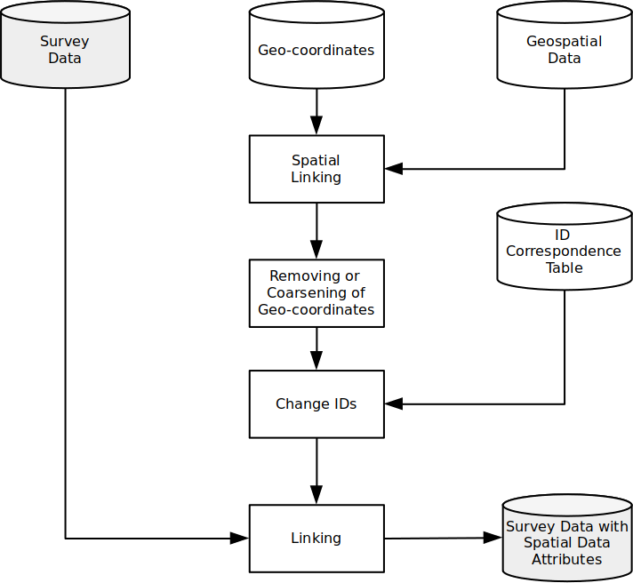
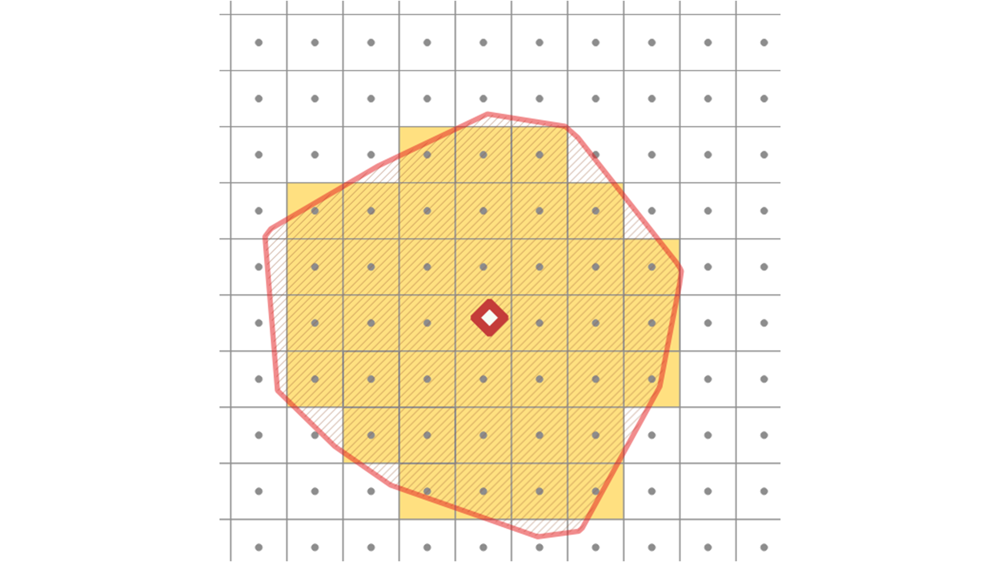
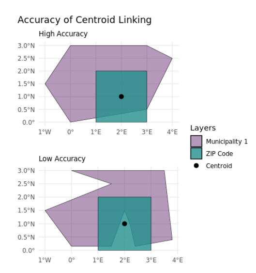
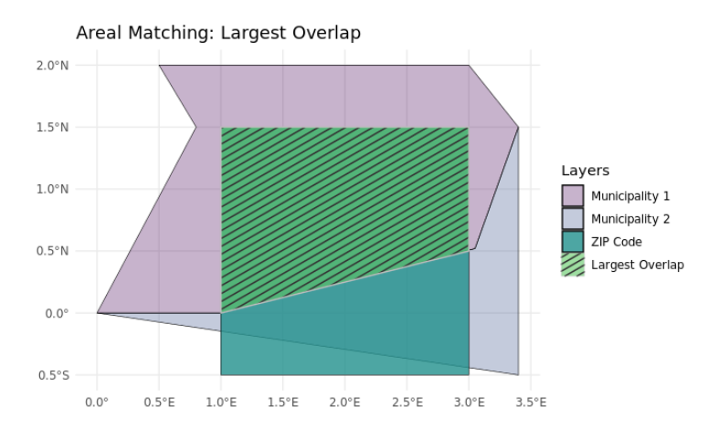
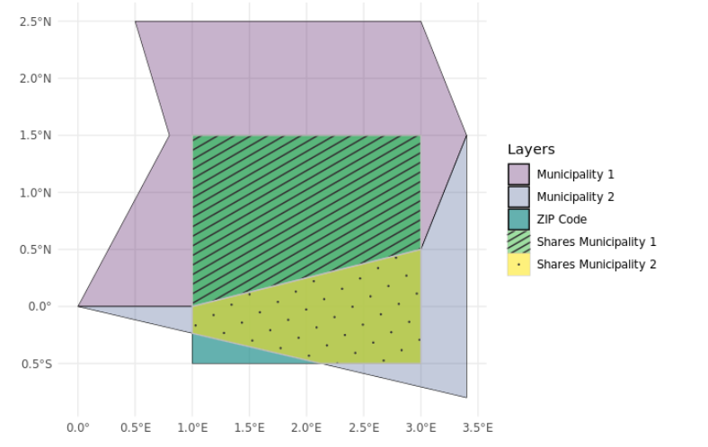

```{r}
#| echo: false
#| include: false
library(sf)
library(dplyr)
library(tmap)
library(tidygeocoder)
library(readr)
library(smoothr)
library(units)
library(maptiles)
```


## Now

```{r}
#| echo: false
source("./_ignore/sessions/course_content.R")

course_content |>
  kableExtra::row_spec(10, background = "yellow") |>
  kableExtra::kable_styling(font_size = 20)
```


## What is Spatial Data Linking?

Sometimes datasets don't have a geocodes, do not include the indicators you need or share congruent borders that make them easy to join

**We add to our toolbox:**

::: {.incremental}
- 🗺️ **Geocoding** — addresses → coordinates
- 📏 **Distance & Proximity** — how far? nearest what?
- 🚗 **Travel Time** — real-world accessibility
- 🔀 **Areal Interpolation** — transferring data across incongruent units
:::

## Geocoding {.center style="text-align: center;"}

## Geocoding

Geocoding is the conversion of indirect spatial references (e.g., addresses) into direct spatial references (e.g., coordinates)

However, conducting this procedure is tricky (not only in `R`). Many services are either

- Expensive (at least they cost money or have other restrictions)
- Probably not data protection-friendly (Hey Google)
- Or both


## Georeferenced survey data

One example: Survey data enriched with geo-coordinates (or other direct spatial references).

{.r-stretch fig-align="center"}

**With georeferenced survey data, we can analyze interactions between individual behaviors and attitudes and the environment.**

## Issue Data Protection

:::: columns
::: {.column width="50%"}
Explicit spatial references increase the risk of re-identifying anonymized survey respondents: In Germany, storing personal information such as addresses in the same place as actual survey attributes is usually not allowed.

- Projects keep them in separate locations
- Can only be matched with a correspondence table
- Necessary to conduct data linking
- Access often only via Safe Rooms/Secure Data Centers
:::

::: {.column width="50%"}
{fig-align="center" width="70%"}


:::
::::


## Our example today: Hospitals (Destatis)

The German Federal Statistical Office ([Destatis](https://www.destatis.de)) publishes an annual **hospital directory** with names and full addresses of all ~1,900 hospitals in Germany that are freely downloadable.

We work with **Cologne hospitals**:

```{r}
#| output-location: fragment
hospitals_cologne <- readxl::read_excel("./data/krankenhausverzeichnis.xlsx", sheet = 5, skip = 2, col_names=TRUE) |> 
  dplyr::select(1:2,4:9) |>
  setNames(c("state", "district", "name", "name2", "street", "housenumber", "zip", "place")) |> 
  dplyr::mutate(address = paste(street, housenumber, zip, place, "Germany"))   |> 
  dplyr::filter(grepl("K.ln", place, ignore.case = TRUE)) 

hospitals_cologne |>
  dplyr::select(name, street, housenumber, zip, place)
```

## Geocoding with `tidygeocoder`

[`tidygeocoder`](https://jessecambon.github.io/tidygeocoder/) provides a tidy interface to many geocoding services. No API key needed when using **OpenStreetMap/Nominatim** (`method = "osm"`).

```{r}
hospitals_geocoded <- hospitals_cologne |>
  tidygeocoder::geocode(
    address = address,   # "Brückenstr. 45 50996 Köln Germany"
    method  = "osm"
  )

hospitals_geocoded |>
  dplyr::select(name, street, housenumber, zip, place, long, lat)
```


## Geocoding with `tidygeocoder`


```{r}
#| output-location: fragment
# Convert to sf point layer
hospitals_sf <- hospitals_geocoded |>
  dplyr::filter(!is.na(long)) |>
  sf::st_as_sf(coords = c("long", "lat"), crs = 4326) |>
  sf::st_transform(3035)

hospitals_sf |> 
  head(10)
```


## Geocoding result

```{r}
#| fig.asp: 1
#| output-location: column-fragment
cologne_outline <- sf::read_sf("./data/VG250_KRS.shp") |>
  dplyr::filter(GEN == "Köln") |>
  sf::st_transform(3035)

tm_shape(cologne_outline) +
  tm_polygons(fill = "lightgrey", col = NA) +
tm_shape(hospitals_sf) +
  tm_dots(fill = "#440154FF", size = 0.5) +
  tm_title("Cologne hospitals — geocoded")
```


## Geocoding result

```{r}
#| fig.asp: 1
#| output-location: column-fragment
cologne_outline <- sf::read_sf("./data/VG250_KRS.shp") |>
  dplyr::filter(GEN == "Köln") |>
  sf::st_transform(3035)

tm_shape(cologne_outline) +
  tm_polygons(fill = "lightgrey", col = NA) +
tm_shape(hospitals_sf |>  head(5)) +
  tm_dots(fill = "#440154FF", size = 0.35) +
  tm_text(
    "name",
    size        = 1,
    fontface    = "bold",
    col         = "#222222",
    ymod        = 0.7) +
  tm_title("Cologne hospitals — geocoded")
```


## Common geocoding pitfalls

- **Duplicates**: Several locations of one facility or true duplicates? 
- **Ambiguous place names**: "Köln" vs "Cologne" vs "Köln, Germany" 
- **Missing (string) matches**: some addresses fail, additional information in adress fields that do not belong there ( basically a record linkage problem)
- **Rate limits**: free APIs limit requests 

A lot of "ready-to-use" tools but need to check data quality.

```{r}
# Check how many geocoded successfully
hospitals_geocoded |>
  dplyr::summarise(
    total = dplyr::n(),
    matched = sum(!is.na(lat)),
    match_rate = mean(!is.na(lat))
  )
```


## `bkggeocoder`

:::: columns
::: {.column width="50%"}
`R` package `bkggeocoder` developed at GESIS for (offline) geocoding with the Federal Agency for Cartography (BKG):

- Access via [Github](https://github.com/StefanJuenger/bkggeocoder)
- Introduction in the [Meet the Experts Talk](https://www.youtube.com/watch?v=ZnA21LyKK88&feature=youtu.be)
:::

::: {.column width="50%"}
{fig-align="center" width="50%"}
:::
::::

## New interface in the `sora` package

We can now also use the `sora` package to geocode addresses (but thus far, with fewer features than `bkggeocoder`).

- Designed specifically for data-protection-compliant geocoding of **survey respondent addresses**
- Keeps addresses and survey data separate
- Integrates geocoding + spatial linking in one workflow

... and it can do even more! (see backup files)

## Why geocoding?

Geocoding is particularly interesting in survey research: we want to link respondents' locations to contextual data.

:::: columns
::: {.column .fragment width="50%"}
**The workflow:**

1. Geocode respondent addresses 
2. Link coordinates to spatial data (rasters, polygons)
3. Attach context variables to survey dataset
4. Model individual outcomes with spatial context
::: 
::: {.column .fragment width="50%"}
**But the same techniques apply to:**

- Firms and their addresses 
- Public institutions 
- Event data locations 
- Historical monuments
- ....
::: 
:::: 

## Distance & Proximity {.center style="text-align: center;"}


## Why distance matters in social science

Distance shapes **behaviour**, **exposure**, and **access**: it is one of the most fundamental spatial variables.

::::: columns
::: {.column .fragment width="50%"}
**Survey / individual level:**

- Distance from respondent to nearest polling station → turnout
- Distance to refugee shelter → attitudes toward refugees
- Distance to nearest hospital → health care utilisation
- Distance to school → educational choice
:::

::: {.column .fragment width="50%"}
**Aggregate / contextual level:**

- Average hospital distance per municipality → accessibility index
- Distance to border → cultural and economic integration
:::
:::::

## Centroids: the starting point for polygon distances

When you want to compute distances *from* polygons (e.g., voting precincts, municipalities), you first need a representative point, i.e. the **centroid**.

```{r}
#| fig.asp: 1
#| output-location: column-fragment
stimmbezirke <- sf::read_sf("./data/Stimmbezirk.shp") |>
  sf::st_set_crs(25832) |>   # ETRS89 / UTM Zone 32N
  sf::st_transform(3035)

# Compute centroids
stimmbezirk_centroids <- sf::st_centroid(stimmbezirke)

# Visualise: polygons + centroids
tm_shape(stimmbezirke) +
  tm_polygons(fill = "lightgrey", col = "white", lwd = 0.4) +
tm_shape(stimmbezirk_centroids) +
  tm_dots(fill = "#440154FF", size = 0.2) +
  tm_title("Cologne voting precinct centroids")
```

## `sf::st_distance()` 

`st_distance()` computes distances between **all pairs** of features across two datasets. The result is an **n × m matrix** (n precincts × m hospitals). Units are metres because of CRS3035.

```{r}
#| output-location: fragment
# hospitals_sf loaded from geocoding section 
hospitals_sf_3035 <- sf::st_transform(hospitals_sf, 3035)

# Distance from first 5 precincts to all 12 hospitals (in metres)
dist_matrix <- sf::st_distance(
  stimmbezirk_centroids[1:5, ],
  hospitals_sf_3035
)

round(dist_matrix)
```


## `sf::st_nearest_feature()`: nearest neighbour

For each feature in X, find the **index** of the nearest feature in Y and then calculate distance:

```{r}
#| output-location: fragment
#| code-line-numbers: "1-4"
# For each precinct centroid: index of the nearest hospital
nearest_hospital <- sf::st_nearest_feature(
  stimmbezirk_centroids,
  hospitals_sf_3035
)

head(nearest_hospital)
```

::: {.fragment}
```{r}
#| code-line-numbers: "1-8"
# Use the index to get distances (by_element = TRUE → one distance per row)
stimmbezirke$dist_to_hospital <- sf::st_distance(
  stimmbezirk_centroids,
  hospitals_sf_3035[nearest_hospital, ],
  by_element = TRUE
)

# Convert to numeric (metres)
stimmbezirke$dist_to_hospital_m <- as.numeric(stimmbezirke$dist_to_hospital)
```
:::


## Hospital accessibility per voting precinct

```{r}
#| fig.asp: 1
#| output-location: column-fragment
tm_shape(stimmbezirke) +
  tm_polygons(
    fill = "dist_to_hospital_m",
    fill.legend = tm_legend(
      title = "Distance to nearest\nhospital (m)"
    ),
    fill.scale = tm_scale_intervals(
      style  = "quantile",
      n      = 5,
      values = "viridis"
    ),
    col = NA
  )
```


## Travel Time & Isochrones {.center style="text-align: center;"}


## As the crow flies, or not?

::::: columns
::: {.column width="50%"}

**Straight-line distance** is a useful approximation, but **travel time** better captures real accessibility.

**Isochrones**

An isochrone is a polygon that defines all points reachable within a given travel time from an origin.

- 15-min drive → catchment area of a hospital
- 30-min walk → effective service radius of a school
:::

::: {.column width="50%"}
{fig-align="center" width="90%"}
:::
:::::


## The `osrm` package

[`osrm`](https://rgeomatic.hypotheses.org/2555) provides an R interface to the **OpenStreetMap Routing Machine (OSRM)** which is an open-source routing engine that computes travel times and routes using OSM road network data.

```{r}
#| eval: false

library(osrm)

# Filter to a Cologne hospital
cologne_hospital <- hospitals_sf |>
  dplyr::filter(grepl("Köln|Cologne", ort, ignore.case = TRUE)) |>
  head(1)

iso <- osrm::osrmIsochrone(
  loc    = cologne_hospital,
  breaks = c(15, 30),
  n    = 500
)
```


```{r}
#| echo: false
# Load pre-computed isochrone result
# Run prep_isochrones.R first to create this file
if (file.exists("./data/isochrones_cologne_hospital.rds") &&
    !is.null(hospitals_sf)) {
  iso <- readRDS("./data/isochrones_cologne_hospital.rds")
  cologne_hospital <- hospitals_sf |>
    head(1) |>
    sf::st_transform(4326)
}
```

## Isochrones around a Cologne hospital


```{r}
#| fig.asp: .7
#| output-location: column-fragment
# Clean up: fill small holes, label zones
iso_clean <- iso |>
  dplyr::mutate(zone = paste0(isomin, "–", isomax, " min")) |>
  dplyr::group_by(zone) |>
  dplyr::summarize(geometry = sf::st_union(geometry))

# cut iso_map to cologne
cologne_bg <- sf::read_sf("./data/VG250_KRS.shp") |>
  dplyr::filter(GEN == "Köln") |>
  sf::st_transform(sf::st_crs(iso_clean))

iso_cologne <- sf::st_intersection(iso_clean, cologne_bg)

# Basemap tile with river
 tiles <- maptiles::get_tiles(
   cologne_bg,
   provider = "CartoDB.Positron",
   zoom = 11,
   crop = TRUE
 )

# Plot
 tm_shape(tiles) +
   tm_rgb() +
tm_shape(iso_cologne) +
  tm_polygons(
    fill  = "zone",
    fill.scale = tm_scale_categorical(
      values = c("0–15 min" = "#f4a582", "15–30 min" = "#92c5de")
    ),
    fill.legend = tm_legend(title = "Drive time"),
    fill_alpha = 0.7,
    col = NA
  ) +
tm_shape(cologne_bg) +
  tm_borders(col = "grey40", lwd = 1) +
tm_shape(cologne_hospital |> sf::st_transform(sf::st_crs(iso_clean))) +
  tm_dots(fill = "red", size = 0.4)
```


## `rors`: an alternative routing package

[`rors`](https://jslth.github.io/rors/) (R OpenRouteService) is an alternative that connects to **OpenRouteService** and supports more transport modes:

- 🚗 Driving (car)
- 🚲 Cycling
- 🚶 Walking / foot
- ♿ Wheelchair

```{r}
#| eval: false
library(rors)

# Requires free API key from openrouteservice.org
ors_isochrones(
  locations = hospitals_sf[1, ],
  profile   = "foot-walking",
  range     = c(1800, 3600),  # in seconds: 30 and 60 minutes
  range_type = "time"
)
```


## Exercise 5_1: Geocoding & Proximity 💪 {.center style="text-align: center;"}

🖱️ [Exercise 5_1: Geocoding & Proximity](https://denabel.github.io/BIGSSS_geo_2026/exercises/5_1_Geocoding_Proximity.html)


## Spatial Alignment & Incongruent Units {.center style="text-align: center;"}

## Three operations = three different results

A common point of confusion: `st_intersects`, `st_join`, and `st_intersection` sound similar but do very different things.

| Function | What it returns | Geometry changes? |
|---|---|---|
| `st_intersects()` | TRUE/FALSE for each pair | No |
| `st_join()` | Attributes transferred, original geometry kept | No |
| **`st_intersection()`** | New features for each overlapping piece | **Yes — geometries are cut** |

But often we want to join even if incongruent!

## A genuinely incongruent case: ZIP ≠ Municipalities

**Postal code areas (PLZ)** and **municipalities (Gemeinden)** are two of the most common spatial units in German social science and their boundaries don't align at all.

::::: columns
::: {.column width="50%"}
- Survey respondents are often geocoded by **ZIP code** (what they self-report)
- Context variables (population density, economic infos) are measured at **municipality** level
- A single ZIP code can straddle multiple municipalities — and vice versa
:::

::: {.column width="50%"}
```{r}
#| output-location: fragment
zip_codes <- sf::st_read(
  "./data/plz_gebiete.gpkg",
  quiet = TRUE
) |>
  dplyr::select(zip_code = plz,
                inhabitants_zip = einwohner)

municipalities <- sf::st_read(
  "./data/gemeindegrenzen_2022.gpkg",
  quiet = TRUE
) |>
  dplyr::select(ags = AGS,
                inhabitants_mun = EWZ,
                area_mun = KFL)

nrow(zip_codes)
nrow(municipalities)
```
:::
:::::


## Side-by-side: two different polygon layers

```{r}
#| echo: false
# Subset to a manageable region for display (NRW bounding box approx)
bbox_nrw <- sf::st_bbox(c(xmin=5.9, ymin=50.3, xmax=9.5, ymax=52.5),
                         crs = sf::st_crs(4326)) |>
  sf::st_as_sfc()

zip_nrw <- zip_codes[sf::st_intersects(
  zip_codes, sf::st_transform(bbox_nrw, sf::st_crs(zip_codes)),
  sparse = FALSE)[,1], ]

mun_nrw <- municipalities[sf::st_intersects(
  municipalities, sf::st_transform(bbox_nrw, sf::st_crs(municipalities)),
  sparse = FALSE)[,1], ]
```

::::: columns
::: {.column width="50%"}
```{r}
#| echo: false
#| fig.asp: 1
tm_shape(zip_nrw) +
  tm_polygons(fill = "#bc3754", fill_alpha = 0.4, col = "white", lwd = 0.2) +
  tm_title("ZIP code areas (PLZ)")
```
:::

::: {.column width="50%"}
```{r}
#| echo: false
#| fig.asp: 1
tm_shape(mun_nrw) +
  tm_polygons(fill = "#f98e09", fill_alpha = 0.4, col = "white", lwd = 0.2) +
  tm_title("Municipalities (Gemeinden)")
```
:::
:::::


## Performing the intersection

```{r}
#| output-location: fragment
# Work with a small subset for speed
zip_sub <- zip_nrw |>
  dplyr::slice(1:50) 

intersection <- sf::st_intersection(zip_sub, mun_nrw)

# Number of ZIP code
nrow(zip_sub)

# After intersection: each zip "piece" municipality information
nrow(intersection)
```

::: {.fragment}
```{r}

# calculate area of each zip-municipality overlap
intersection$area_m2 <- as.numeric(sf::st_area(intersection))

intersection |>
  sf::st_drop_geometry() |>
  dplyr::select(zip_code, ags, area_m2) |>
  head(5)
```
:::


## The problem: which municipality does a survey respondent belong to?

Imagine: For each respondent we have a ZIP code but we need to match population density from a municipality-level data set. So we need to decide: In which 
municipality does each survey respondent live?

{.r-stretch fig-align="center"}

## Method 1: Centroid matching

Assign the municipality whose territory contains the **centroid** of the respondent's ZIP code. This is fast and simple but ignores that zip code
straddle several municipalities or distribution of inhabitants.


::::: columns
::: {.column width="50%"}
```{r}
centroid_matched <- zip_sub |>
  sf::st_centroid() |>
  sf::st_join(municipalities) |>
  dplyr::select(zip_code, inhabitants_mun, area_mun) |>
  dplyr::distinct()

head(centroid_matched |> sf::st_drop_geometry(), 4)
```

:::

::: {.column width="50%"}
{fig-align="center" size="20%"}

:::
:::::


## Method 2: Areal matching

Assign the municipality with the **largest overlap area** with the respondent's ZIP code. This method accounts for the spatial overlap but we still lose information

::::: columns
::: {.column width="50%"}
```{r}
areal_matched <- zip_sub |>
  sf::st_join(municipalities, left = TRUE, largest = TRUE) |>
  dplyr::select(zip_code, inhabitants_zip, inhabitants_mun, area_mun) |>
  dplyr::distinct()

head(areal_matched |> sf::st_drop_geometry(), 4)
```
:::

::: {.column width="50%"}
{fig-align="center" size="30%"}
:::
:::::


## Method 3: Areal interpolation

**Redistribute** municipality attributes proportionally to the area of overlap 
with each ZIP code. Values reflect partial overlap proportionally but still 
assumes uniform distribution within municipalities.

::::: columns
::: {.column width="50%"}
```{r}
areal_interpolation_matched <- sf::st_interpolate_aw(
  municipalities["inhabitants_mun"],
  zip_sub,
  extensive = FALSE
) |>
  dplyr::bind_cols(
    zip_sub |>
      sf::st_drop_geometry() |>
      dplyr::select(zip_code, inhabitants_zip)
  ) |>
  dplyr::select(zip_code, inhabitants_zip, inhabitants_mun) |>
  dplyr::distinct()

head(areal_interpolation_matched |> sf::st_drop_geometry(), 4)
```


:::

::: {.column width="50%"}
{fig-align="center" sizr="30%"}

:::
:::::


## Going further

::::: columns
::: {.column width="50%"}
**Full evaluation: the AreaMatch tool**

The [AreaMatch tool](https://kodaqs-toolbox.gesis.org/github.com/StefanJuenger/zipmatching/index/) (KODAQS Toolbox) runs all three methods, compares their accuracy against ground truth, and shows how method choice affects research conclusions.

:::

::: {.column width="50%"}
**Other R packages for interpolation**

- **`areal`** — CRAN package, similar to sf but more explicit control
- **`smile`** — model-based areal interpolation for more complex cases

All assume some form of uniform within-unit distribution but the harder the spatial heterogeneity, the larger the bias.
:::
:::::

## Backup / For Home Use {.center style="text-align: center;"}


## Georeferenced survey data with `sora`

For researchers working with **geocoded survey data**, the [`sora`](https://sora-service.org/) package provides a complete, data-protection-compliant workflow for spatial linking.

```{r}
#| eval: false
library(sora)

# Set API key
Sys.setenv(SORA_API_KEY = readLines("sora_key"))
sora_available()

# Load your geocoordinates as a custom dataset
my_survey_coords <- sora::sora_custom(
  data = synthetic_survey_geocoordinates,
  lat  = "lat",
  lon  = "lon"
)

# Link to a spatial dataset (e.g., IOER Monitor indicators)
result <- sora::sora_request(
  data           = my_survey_coords,
  dataset        = "your_dataset_id",
  selection_area = "circle",
  radius         = 1000,  # metres
  output         = "mean",
  wait           = TRUE
)
```

[Register for SoRa API access](https://sora.gesis.org/public/sora-user-mod/users/request-api-key)


## `sora` linking methods

`sora` supports multiple spatial linking strategies that are each suitable for different research questions:

::::: columns
::: {.column width="33%"}
**Circle**

Straight-line buffer around each point

```r
sora_request(
  selection_area = "circle",
  radius = 1000
)
```
:::

::: {.column width="33%"}
**Square**

Bounding box around each point

```r
sora_request(
  selection_area = "square",
  length = 1000
)
```
:::

::: {.column width="33%"}
**Isochrone**

Travel-time catchment area

```r
sora_request(
  selection_area = "isochrone",
  transport_mode = "foot-walking",
  routing_type   = "time",
  interval       = 10
)
```
:::
:::::

[SoRa slides](https://stefanjuenger.github.io/gesis-workshop-geospatial-techniques-R-2026/exercises/6_Using_SoRa.html)
[SoRa exercise](https://stefanjuenger.github.io/gesis-workshop-geospatial-techniques-R-2026/exercises/6_Using_SoRa.html)